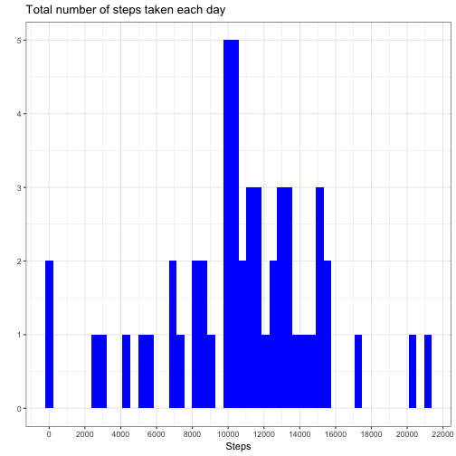
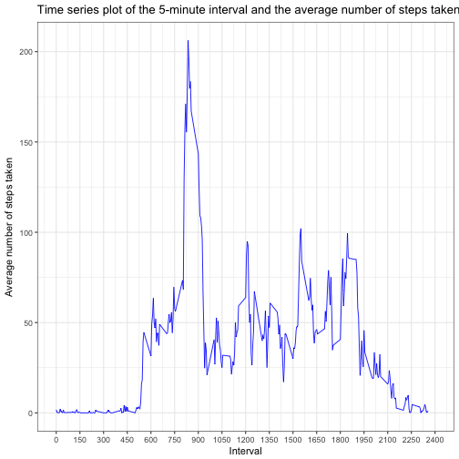
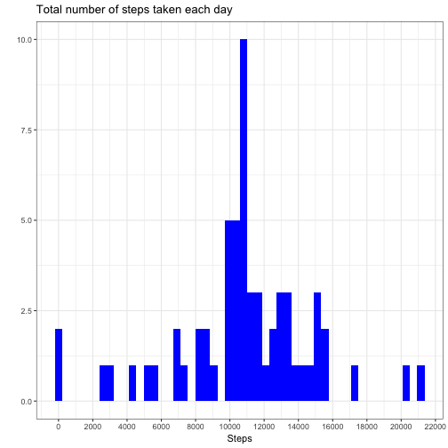
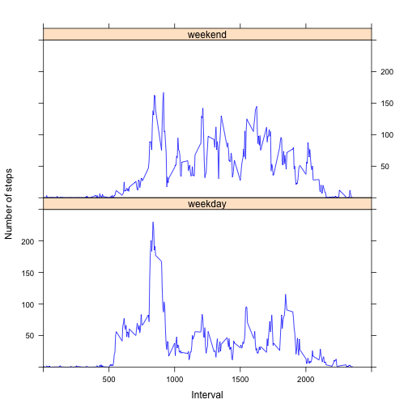

## Loading and preprocessing the data

Down here, the data have been loaded into the working directory.


```r
df <- read.csv("~/Desktop/R/Course 5/Project Assignment 1/activity.csv", header = TRUE, sep = ",")
str(df)
```

```
## 'data.frame':	17568 obs. of  3 variables:
##  $ steps   : int  NA NA NA NA NA NA NA NA NA NA ...
##  $ date    : Factor w/ 61 levels "2012-10-01","2012-10-02",..: 1 1 1 1 1 1 1 1 1 1 ...
##  $ interval: int  0 5 10 15 20 25 30 35 40 45 ...
```

```r
df$date <- as.Date(df$date)
```

## What is mean total number of steps taken per day?

For this part,ignoring the missing values,  
1. a histogram of the total number of steps taken each day have been plotted; and,   
2. the mean and median total number of steps taken per day have been produced and reported. 

*Note: The graphs have been plotted using ggplot2 package.*


```r
library(ggplot2)
library(dplyr)

complete_df <- df %>%
    filter(!is.na(steps)) %>%
    group_by(date) %>%
    summarise(Total_per_day = sum(steps, na.rm = TRUE))

g <- ggplot(data = complete_df, aes(Total_per_day))
g  + geom_histogram(bins = 50, fill = "blue") +
    labs(
        title ="Total number of steps taken each day",
        x = "Steps",
        y = "") +
    theme_bw() +
    scale_x_continuous(breaks = seq(from = 0, to = 22000, by = 2000)) 
```



```r
mean(complete_df$Total_per_day)
```

```
## [1] 10766.19
```

```r
median(complete_df$Total_per_day)
```

```
## [1] 10765
```

## What is the average daily activity pattern?

Here,  
1. A time series plot of the 5-minute interval and the average number of steps taken (i.e., avergared across all days) have been plotted; and,   
2. the 5-minute interval which, on average across all days in the dataset, contains the maximum number of steps has been specified.


```r
complete_df2 <- df %>%
    filter(!is.na(steps)) %>%
    group_by(interval) %>%
    summarise(Average_per_interval = mean(steps))

g <- ggplot(data = complete_df2, aes(interval, Average_per_interval))
g  + geom_line(size = .4, color = "blue") +
    labs(
        title ="Time series plot of the 5-minute interval and the average number of steps taken",
        x = "Interval",
        y = "Average number of steps taken") +
    theme_bw() +
    scale_x_continuous(limits = c(0, 2400), breaks = seq(from = 0, to = 2400, by = 150))
```



```r
complete_df2[complete_df2$Average_per_interval== max(complete_df2$Average_per_interval), ]
```

```
## # A tibble: 1 x 2
##   interval Average_per_interval
##      <int>                <dbl>
## 1      835             206.1698
```

## Imputing missing values

To handle the issue of missing values, below,  
1. The total number of missing values in the dataset has been calculated and reported.  
2. The mean for each 5-minute interval has been used to impute the missing values.  
3. A new dataset including the imputed missing values has been created.  
4. A histogram of the total number of steps taken each and and the mean and median of the total number of steps taken per day have been produced.  
5. The impacts of imputing the missing values have been examined.


```r
library(tidyimpute)
sum(is.na(df$steps))
```

```
## [1] 2304
```

```r
# the average steps per interval calculated in the previous section have been used to impute the missing values, and created a new dataset including the imputed values.
imputed_values <- complete_df2$Average_per_interval
new_df <- df %>%
    mutate(steps = ifelse(is.na(steps),imputed_values, steps))
    
    
imputed_df <- new_df %>%
    group_by(date) %>%
    summarise(Total_per_day = sum(steps))

g <- ggplot(data = imputed_df, aes(Total_per_day))
g  + geom_histogram(bins = 50, fill = "blue") +
    labs(
        title ="Total number of steps taken each day",
        x = "Steps",
        y = "") +
    theme_bw() +
    scale_x_continuous(breaks = seq(from = 0, to = 22000, by = 2000)) 
```



```r
mean(imputed_df$Total_per_day)
```

```
## [1] 10766.19
```

```r
median(imputed_df$Total_per_day)
```

```
## [1] 10766.19
```

Dataset | Mean of total number of steps (per day) | Median of total number of steps (per day)
------------- | ------------- | -------------
Non-missing dataset | 10766.19 | 10765
Imputed dataset | 10766.19 | 10766.19

As can be seen in the table above, mean of total number of steps are equal between the two datasets, but the median has changed (i.e., increased) for the imputed dataset.

As for the estimates of the total number of steps daily, the results show:

```r
summary(complete_df$Total_per_day)
```

```
##    Min. 1st Qu.  Median    Mean 3rd Qu.    Max. 
##      41    8841   10760   10770   13290   21190
```

```r
summary(imputed_df$Total_per_day)
```

```
##    Min. 1st Qu.  Median    Mean 3rd Qu.    Max. 
##      41    9819   10770   10770   12810   21190
```
Hence, minimum and maximum number of total steps daily are equal across the two datasets.

## Are there differences in activity patterns between weekdays and weekends?

Using the imputed dataset,   
1. A new factor variable has been created in the dataset with two levels -- "weekday" and "weekend".  
2. A panel plot containing a time series plot (i.e. type = "l") of the 5-minute interval (x-axis) and the average number of steps taken, averaged across all weekday days or weekend days (y-axis) has been created.


```r
library(lattice)

weekdays_df <- new_df %>%
    mutate(day = weekdays(date)) %>%
    mutate(dicho_day = ifelse(day %in% c("Sunday","Saturday"), "weekend", "weekday")) %>%
    group_by(interval, dicho_day) %>%
    summarise(Average_per_interval = mean(steps))

x_limits <- seq(0, 2500, by = 500)
y_limits <- seq(0,250, by = 50)

xyplot(Average_per_interval ~ interval | dicho_day, data = weekdays_df, layout = c(1,2), type = "l", col.line = "blue", xlab = "Interval", ylab = "Number of steps", xlim = x_limits, ylim = y_limits)
```



